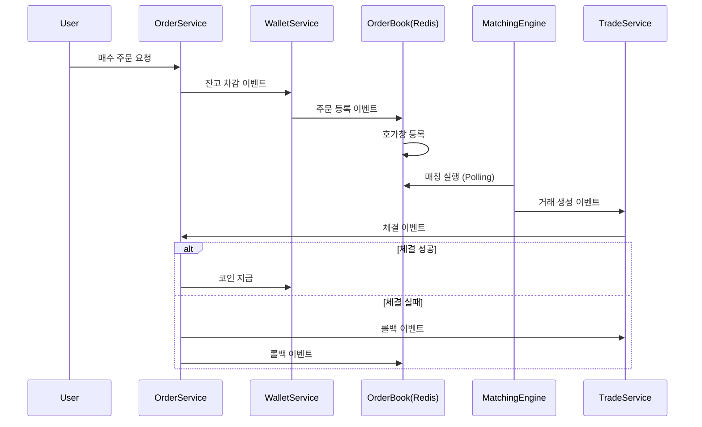

# 코인 거래소

EDA 기반의 코인 거래소 백엔드 시스템. 서비스 간 결합도를 낮추고 SAGA 패턴으로 트랜잭션 정합성을 보장

## 기술 스택

- Spring Boot 3.4
- MySQL
- Redis (매칭엔진 OrderBook)
- RabbitMQ (이벤트 브로커)
- Spring Security, JWT

## 핵심 기능

- **EDA**: 입금/출금/주문 처리를 이벤트 기반으로 분리, 서비스 간 독립성 확보
- **SAGA 패턴**: 이벤트로 분리된 트랜잭션에서 실패 시 보상 트랜잭션으로 정합성 복구
- **매칭엔진**: Redis 기반 호가창으로 대규모 트래픽 대비
- **동시성 제어**: 비관적 락으로 출금 동시 요청 시 정합성 보장

## 매수/매도 흐름 요약

## 문서

| 문서 | 설명 |
|------|------|
| [EDA 도입](docs/EDA%20도입.md) | 이벤트 기반 아키텍처 도입 배경과 구현 |
| [SAGA 패턴](docs/보상%20트랜잭션(feat.%20SAGA%20패턴).md) | 이벤트 기반 트랜잭션 정합성 보장 |
| [매칭엔진 성능 개선](docs/매칭엔진%20성능%20개선.md) | DB → Redis 마이그레이션 및 성능 테스트 |
| [출금 실패 처리](docs/출금%20실패%20처리.md) | 동시성 문제 해결 (비관적 락) |
| [플로우](docs/플로우.md) | 입금/매수/매도 전체 흐름 |
