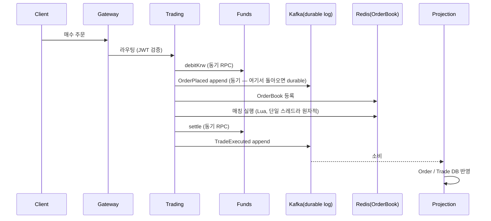

# 코인 거래소

대용량 트래픽을 가정한 거래소 백엔드. 모듈러 모놀리스에서 MSA로 분리하며, **구조 변경마다 측정으로 근거를 만들고 근거가 없으면 되돌리는 방식**으로 진행했다.

이 저장소의 핵심은 기능 목록이 아니라 **결정의 근거**다. 도입한 기술만큼 도입하지 않기로 한 기술도 측정으로 남겼다.

## 구성

| 서비스 | 역할 | 상태 |
|---|---|---|
| gateway | 라우팅, JWT 검증 | 무상태 |
| user | 회원 | user-db |
| trading | 주문 hot path, 매칭 실행 | **무상태** (Redis + Kafka + RPC) |
| funds | 지갑, 잔고 차감·정산 | funds-db |
| projection | 주문 로그 소비 → DB 반영 | trading-db |
| notification | 알림 | RabbitMQ 소비 |

저장소·미들웨어: MySQL(도메인별 분리), Redis(매칭 OrderBook), Kafka(주문 durable 로그), RabbitMQ(알림), Prometheus/Grafana/Zipkin, k8s 매니페스트.

## 주문 흐름


```mermaid
sequenceDiagram
    participant C as Client
    participant G as Gateway
    participant T as Trading
    participant F as Funds
    participant K as Kafka(durable log)
    participant R as Redis(OrderBook)
    participant P as Projection

    C->>G: 매수 주문
    G->>T: 라우팅 (JWT 검증)
    T->>F: debitKrw (동기 RPC)
    T->>K: OrderPlaced append (동기 — 여기서 돌아오면 durable)
    T->>R: OrderBook 등록
    T->>R: 매칭 실행 (Lua, 단일 스레드라 원자적)
    T->>F: settle (동기 RPC)
    T->>K: TradeExecuted append
    K-->>P: 소비
    P->>P: Order / Trade DB 반영
```

주문의 진실은 Kafka 로그이고, DB의 Order/Trade는 로그를 소비한 projection이 만드는 사본이다. 돈이 걸린 차감·정산만 즉시 정합성이 필요해 동기 RPC로 남겼다.

## 측정으로 내린 결정들

| 질문 | 측정 결과 | 결정 |
|---|---|---|
| 매칭엔진이 병목인가 | 매칭 4ms, 전체의 **0.1%**. 병목은 주문 DB 저장(76%) | 매칭이 아니라 주문 저장을 재설계 |
| 주문 저장을 hot path에서 빼면 | 처리량 **2배** (50 → 100/s) | Redis 우선 + 비동기 영속화 |
| 내구성의 처리량 비용은 | durable 로그로 바꿔도 **110/s 동일**, 크래시 유실 800건 → **0건** | Kafka durable 로그 채택 |
| Kafka + Outbox + 멱등성이 필요한가 | 멱등성이 처리량의 **38%**(100 → 62/s)를 쓰는데 지키는 건 알림 중복 방지뿐 | **철회**, RabbitMQ로 복귀 |
| 매칭에서 Redis가 DB보다 빠른가 | per-order 기준 **11배** (첫 결과 200배는 O(N²) vs O(N) 구현 격차였음) | Redis 매칭엔진 유지 |
| 네트워크 왕복을 없애면 | 주문당 **660µs → 0.03µs** | 병목이 매칭에서 돈 경로로 이동 |
| 분산 환경의 병목은 | 돈 경로(동기 RPC)가 주문당 **80%** | 확장 대상은 trading이 아니라 funds |
| funds를 HPA로 늘리면 | 복제 시 처리량 **16% 하락** (99 → 83/s) | **기각** — 제약은 앱이 아니라 공유 DB |

## 문서

### 측정·재설계
| 문서 | 내용 |
|---|---|
| [주문 흐름 병목 측정](docs/%EC%A3%BC%EB%AC%B8%20%ED%9D%90%EB%A6%84%20%EB%B3%91%EB%AA%A9%20%EC%B8%A1%EC%A0%95.md) | 가설을 세우고 측정으로 기각해 나간 병목 추적 |
| [주문 저장 재설계](docs/%EC%A3%BC%EB%AC%B8%20%EC%A0%80%EC%9E%A5%20%EC%9E%AC%EC%84%A4%EA%B3%84%20%E2%80%94%20%EB%8F%99%EA%B8%B0%20DB%EC%97%90%EC%84%9C%20durable%20%EB%A1%9C%EA%B7%B8%EB%A1%9C.md) | 동기 DB 쓰기 → durable 로그 + projection |
| [매칭엔진 격리 재측정 — DB vs Redis](docs/%EB%A7%A4%EC%B9%AD%EC%97%94%EC%A7%84%20%EA%B2%A9%EB%A6%AC%20%EC%9E%AC%EC%B8%A1%EC%A0%95%20%E2%80%94%20DB%20vs%20Redis.md) | 공정성·현실성·가설을 세 번 교정한 비교 |
| [매칭엔진 in-process 측정](docs/%EB%A7%A4%EC%B9%AD%EC%97%94%EC%A7%84%20in-process%20%EC%B8%A1%EC%A0%95%20%E2%80%94%20%EC%99%95%EB%B3%B5%20%EC%A0%9C%EA%B1%B0.md) | 네트워크 왕복 제거 시 매칭 비용 |
| [매칭엔진 성능 비교](docs/%EB%A7%A4%EC%B9%AD%EC%97%94%EC%A7%84%20%EC%84%B1%EB%8A%A5%20%EB%B9%84%EA%B5%90.md) | 시스템 레벨 초기 비교 (한계 포함) |

### MSA 마이그레이션
**먼저 읽을 것 → [챕터 회고 — 계획은 어떻게 틀렸나](docs/migration/15-retrospective.md)**  
계획서와 실제 결과의 차이, 도입했다 철회한 것과 기각한 것을 한 번에 정리했다.

[전체 계획](docs/migration/00-plan.md) — 멀티모듈부터 부하 측정까지 14개 챕터.

| 챕터 | 내용 |
|---|---|
| [01](docs/migration/01-multi-module.md) ~ [04](docs/migration/04-gateway.md) | 멀티모듈 · 프로세스 분리 · DB 분리 · gateway |
| [05](docs/migration/05-sync-rpc-and-messaging.md) | 동기 RPC 전환과 **Kafka 철회** (YAGNI) |
| [06](docs/migration/06-scaling.md) | 무엇을 확장할 것인가 — 복제는 병목일 때만 듣는다 |
| [07](docs/migration/07-redis-first-order.md) ~ [09](docs/migration/09-matching-projection-split.md) | Redis 우선 주문 · durable 로그 · projection 분리 |
| [10](docs/migration/10-circuit-breaker.md) ~ [12](docs/migration/12-health-check.md) | 회로차단기 · 분산 트레이싱 · 헬스체크 |
| [13](docs/migration/13-load-measurement.md) | 분산 환경 부하 측정 — 병목은 돈 경로 |
| [14](docs/migration/14-hpa.md) | HPA 검토와 **기각** |
| [15](docs/migration/15-retrospective.md) | **챕터 회고** — 계획 대비 무엇이 달라졌나 |

### 설계 기록
| 문서 | 내용 |
|---|---|
| [EDA 도입](docs/EDA%20%EB%8F%84%EC%9E%85.md) | 초기 이벤트 기반 설계 (이후 05단계에서 동기로 되돌림) |
| [보상 트랜잭션 (SAGA)](docs/%EB%B3%B4%EC%83%81%20%ED%8A%B8%EB%9E%9C%EC%9E%AD%EC%85%98%28feat.%20SAGA%20%ED%8C%A8%ED%84%B4%29.md) | 초기 보상 트랜잭션 설계 |
| [출금 실패 처리](docs/%EC%B6%9C%EA%B8%88%20%EC%8B%A4%ED%8C%A8%20%EC%B2%98%EB%A6%AC.md) | 비관적 락 동시성 제어 |
| [오케스트레이션 선택](docs/%EC%98%A4%EC%BC%80%EC%8A%A4%ED%8A%B8%EB%A0%88%EC%9D%B4%EC%85%98%20%EC%84%A0%ED%83%9D%20%28k8s%20vs%20Docker%20Swarm%29.md) | k8s vs Docker Swarm |
| [플로우](docs/%ED%94%8C%EB%A1%9C%EC%9A%B0.md) | 입금/매수/매도 전체 흐름 |

## 실행

```bash
docker compose up -d          # 전체 스택 (서비스 6개 + 인프라)
```

k8s 매니페스트는 `k8s/` 아래에 있다.
