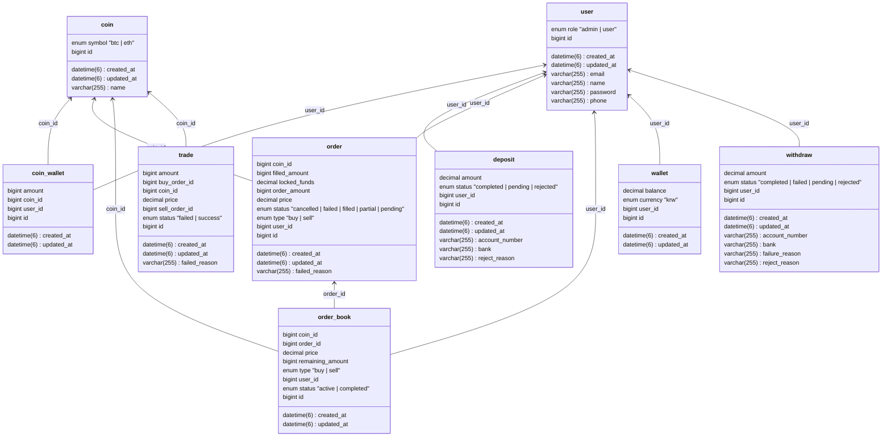

## 📘 테이블 및 컬럼 설명

---

### 🧑‍💼 `user` (사용자 정보)

| 컬럼명      | 타입          | 설명                                 |
|------------|---------------|--------------------------------------|
| `id`       | `bigint`      | 사용자 고유 ID (PK)                  |
| `email`    | `varchar(255)`| 사용자 이메일 (로그인 ID)            |
| `password` | `varchar(255)`| 암호화된 비밀번호                    |
| `name`     | `varchar(255)`| 사용자 이름                          |
| `phone`    | `varchar(255)`| 사용자 전화번호                      |
| `role`     | `enum`        | 사용자 역할 (`admin`, `user`)        |
| `created_at` | `datetime(6)`| 생성일시                             |
| `updated_at` | `datetime(6)`| 수정일시                             |

---

### 🪙 `coin` (코인 정보)

| 컬럼명       | 타입           | 설명                             |
|--------------|----------------|----------------------------------|
| `id`         | `bigint`       | 코인 고유 ID (PK)                |
| `name`       | `varchar(255)` | 코인 이름                         |
| `symbol`     | `enum`         | 심볼 (`btc`, `eth`)              |
| `created_at` | `datetime(6)`  | 생성일시                         |
| `updated_at` | `datetime(6)`  | 수정일시                         |

---

### 💼 `wallet` (원화 지갑)

| 컬럼명       | 타입           | 설명                             |
|--------------|----------------|----------------------------------|
| `id`         | `bigint`       | 지갑 고유 ID (PK)                |
| `user_id`    | `bigint`       | 사용자 ID (FK)                   |
| `currency`   | `enum`         | 화폐 단위 (`krw`)                |
| `balance`    | `decimal`      | 원화 잔액                        |
| `created_at` | `datetime(6)`  | 생성일시                         |
| `updated_at` | `datetime(6)`  | 수정일시                         |

---

### 🪙 `coin_wallet` (코인 지갑)

| 컬럼명       | 타입           | 설명                             |
|--------------|----------------|----------------------------------|
| `id`         | `bigint`       | 지갑 고유 ID (PK)                |
| `user_id`    | `bigint`       | 사용자 ID (FK)                   |
| `coin_id`    | `bigint`       | 코인 ID (FK)                     |
| `amount`     | `bigint`       | 보유 수량                        |
| `created_at` | `datetime(6)`  | 생성일시                         |
| `updated_at` | `datetime(6)`  | 수정일시                         |

---

### 💳 `deposit` (입금 요청)

| 컬럼명         | 타입           | 설명                                         |
|----------------|----------------|----------------------------------------------|
| `id`           | `bigint`       | 입금 요청 고유 ID (PK)                       |
| `user_id`      | `bigint`       | 사용자 ID (FK)                               |
| `account_number` | `varchar(255)` | 입금 계좌번호                                 |
| `bank`         | `varchar(255)` | 입금 은행 이름                                |
| `amount`       | `decimal`      | 입금 금액                                    |
| `status`       | `enum`         | 입금 상태 (`completed`, `pending`, `rejected`) |
| `reject_reason`| `varchar(255)` | 거절 사유 (선택)                             |
| `created_at`   | `datetime(6)`  | 생성일시                                     |
| `updated_at`   | `datetime(6)`  | 수정일시                                     |

---

### 💸 `withdraw` (출금 요청)

| 컬럼명           | 타입           | 설명                                                   |
|------------------|----------------|--------------------------------------------------------|
| `id`             | `bigint`       | 출금 요청 고유 ID (PK)                                 |
| `user_id`        | `bigint`       | 사용자 ID (FK)                                         |
| `account_number` | `varchar(255)` | 출금 계좌번호                                          |
| `bank`           | `varchar(255)` | 출금 은행 이름                                         |
| `amount`         | `decimal`      | 출금 금액                                              |
| `status`         | `enum`         | 출금 상태 (`completed`, `failed`, `pending`, `rejected`) |
| `failure_reason` | `varchar(255)` | 실패 사유 (선택)                                       |
| `reject_reason`  | `varchar(255)` | 거절 사유 (선택)                                       |
| `created_at`     | `datetime(6)`  | 생성일시                                               |
| `updated_at`     | `datetime(6)`  | 수정일시                                               |

---

### 📈 `order` (주문 정보)

| 컬럼명           | 타입           | 설명                                                   |
|------------------|----------------|--------------------------------------------------------|
| `id`             | `bigint`       | 주문 고유 ID (PK)                                      |
| `user_id`        | `bigint`       | 사용자 ID (FK)                                         |
| `coin_id`        | `bigint`       | 코인 ID (FK)                                           |
| `type`           | `enum`         | 주문 방향 (`buy`, `sell`)                              |
| `price`          | `decimal`      | 주문 가격                                               |
| `order_amount`   | `bigint`       | 총 주문 수량                                            |
| `filled_amount`  | `bigint`       | 체결된 수량 (누적)                                     |
| `locked_funds`   | `decimal`      | 잠금된 자산 (지정가 매수 시 잔고에서 보류)              |
| `status`         | `enum`         | 주문 상태 (`cancelled`, `failed`, `filled`, `partial`, `pending`) |
| `failed_reason`  | `varchar(255)` | 실패 사유 (선택)                                       |
| `created_at`     | `datetime(6)`  | 생성일시                                               |
| `updated_at`     | `datetime(6)`  | 수정일시                                               |

---

### 📊 `order_book` (호가 정보)

| 컬럼명            | 타입           | 설명                                               |
|-------------------|----------------|----------------------------------------------------|
| `id`              | `bigint`       | 호가 고유 ID (PK)                                  |
| `order_id`        | `bigint`       | 주문 ID (FK)                                       |
| `user_id`         | `bigint`       | 사용자 ID (FK)                                     |
| `coin_id`         | `bigint`       | 코인 ID (FK)                                       |
| `price`           | `decimal`      | 호가 가격                                           |
| `remaining_amount`| `bigint`       | 남은 수량 (체결되지 않은 수량)                     |
| `type`            | `enum`         | 호가 방향 (`buy`, `sell`)                          |
| `status`          | `enum`         | 상태 (`active`, `completed`)                       |
| `created_at`      | `datetime(6)`  | 생성일시                                           |
| `updated_at`      | `datetime(6)`  | 수정일시                                           |

---

### 🔁 `trade` (체결 정보)

| 컬럼명         | 타입           | 설명                                          |
|----------------|----------------|-----------------------------------------------|
| `id`           | `bigint`       | 체결 고유 ID (PK)                              |
| `buy_order_id` | `bigint`       | 매수 주문 ID (FK)                              |
| `sell_order_id`| `bigint`       | 매도 주문 ID (FK)                              |
| `coin_id`      | `bigint`       | 체결된 코인 ID (FK)                            |
| `amount`       | `bigint`       | 체결 수량                                      |
| `price`        | `decimal`      | 체결 가격                                      |
| `status`       | `enum`         | 체결 상태 (`success`, `failed`)                |
| `failed_reason`| `varchar(255)` | 실패 사유 (선택)                               |
| `created_at`   | `datetime(6)`  | 생성일시                                       |
| `updated_at`   | `datetime(6)`  | 수정일시                                       |
