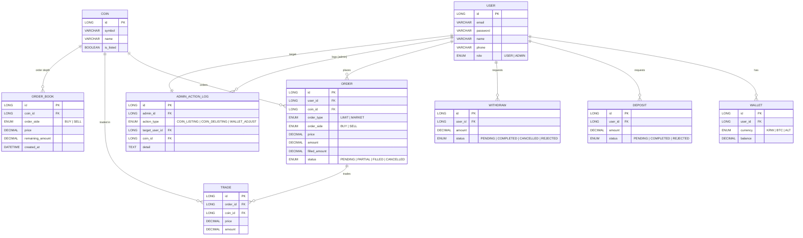

# 📘 테이블 및 컬럼 설명

## USER (사용자 정보)
| 컬럼명     | 타입     | 설명                         |
|------------|----------|------------------------------|
| id         | LONG     | 사용자 고유 ID (PK)          |
| email      | VARCHAR  | 사용자 이메일 (로그인 ID)    |
| password   | VARCHAR  | 암호화된 비밀번호            |
| name       | VARCHAR  | 사용자 이름                  |
| phone      | VARCHAR  | 사용자 전화번호              |
| role       | ENUM     | 사용자 역할 (USER 또는 ADMIN)|

---

## COIN (상장된 코인 정보)
| 컬럼명     | 타입     | 설명                              |
|------------|----------|-----------------------------------|
| id         | LONG     | 코인 고유 ID (PK)                 |
| symbol     | VARCHAR  | 코인 심볼 (예: BTC, ETH)          |
| name       | VARCHAR  | 코인 이름                         |
| is_listed  | BOOLEAN  | 거래소에 상장 여부 (true/false)   |

---

## WALLET (사용자 지갑)
| 컬럼명     | 타입       | 설명                                        |
|------------|------------|---------------------------------------------|
| id         | LONG       | 지갑 고유 ID (PK)                           |
| user_id    | LONG       | 사용자 ID (FK)                              |
| currency   | ENUM       | 지갑의 자산 종류 (KRW, BTC, ALT 중 하나)   |
| balance    | DECIMAL    | 보유 잔고 (소수점 정밀도 필요)             |

---

## ORDER (주문 정보)

| 컬럼명        | 타입     | 설명                                                                 |
|---------------|----------|----------------------------------------------------------------------|
| id            | LONG     | 주문 고유 ID (PK)                                                    |
| user_id       | LONG     | 주문을 낸 사용자 ID (FK)                                             |
| coin_id       | LONG     | 주문 대상 코인 ID (FK)                                               |
| order_type    | ENUM     | 주문 유형 (`LIMIT`: 지정가, `MARKET`: 시장가)                        |
| order_side    | ENUM     | 주문 방향 (`BUY`: 매수, `SELL`: 매도)                                |
| price         | DECIMAL  | 주문 가격 (`MARKET`일 경우 일반적으로 0 또는 NULL 처리)              |
| amount        | DECIMAL  | 주문 총 수량                                                         |
| filled_amount | DECIMAL  | 체결된 수량 (부분 체결 시 누적)                                     |
| status        | ENUM     | 주문 상태 (`PENDING`, `PARTIAL`, `FILLED`, `CANCELLED` 중 하나)      |

---

## ORDER_BOOK (호가 정보)

| 컬럼명           | 타입     | 설명                                                               |
|------------------|----------|--------------------------------------------------------------------|
| id               | LONG     | 호가 정보 고유 ID (PK)                                             |
| coin_id          | LONG     | 해당 호가가 속한 코인 ID (FK)                                      |
| order_side       | ENUM     | 호가 방향 (`BUY`: 매수 호가, `SELL`: 매도 호가)                    |
| price            | DECIMAL  | 호가 가격                                                           |
| remaining_amount | DECIMAL  | 해당 가격에 남아 있는 주문 수량                                   |
| created_at       | DATETIME | 해당 호가가 처음 생성된 시점 (호가 갱신 우선순위 판단 시 사용 가능) |

---

## TRADE (체결 정보)
| 컬럼명     | 타입       | 설명                           |
|------------|------------|--------------------------------|
| id         | LONG       | 체결 고유 ID (PK)              |
| order_id   | LONG       | 체결된 주문 ID (FK)            |
| coin_id    | LONG       | 거래된 코인 ID (FK)            |
| price      | DECIMAL    | 체결 가격                      |
| amount     | DECIMAL    | 체결 수량                      |

---

## DEPOSIT (입금 요청)
| 컬럼명     | 타입       | 설명                                        |
|------------|------------|-------------------------------------------|
| id         | LONG       | 요청 고유 ID (PK)                             |
| user_id    | LONG       | 요청 사용자 ID (FK)                            |
| amount     | DECIMAL    | 요청 입금 금액                                  |
| status     | ENUM       | 요청 상태 (PENDING, COMPLETED, REJECTED 중 하나) |

---

## WITHDRAW (출금 요청)
| 컬럼명     | 타입       | 설명                                         |
|------------|------------|----------------------------------------------|
| id         | LONG       | 요청 고유 ID (PK)                            |
| user_id    | LONG       | 요청 사용자 ID (FK)                          |
| amount     | DECIMAL    | 요청 출금 금액                               |
| status     | ENUM       | 요청 상태 (PENDING, COMPLETED, CANCELLED, REJECTED 중 하나)|

---

## ADMIN_ACTION_LOG (관리자 작업 로그)
| 컬럼명        | 타입     | 설명                                                               |
|---------------|----------|--------------------------------------------------------------------|
| id            | LONG     | 로그 고유 ID (PK)                                                  |
| admin_id      | LONG     | 작업을 수행한 관리자 ID (FK)                                       |
| action_type   | ENUM     | 작업 유형 (COIN_LISTING, COIN_DELISTING, WALLET_ADJUST 중 하나)   |
| target_user_id| LONG     | 영향을 받은 사용자 ID (FK)                                        |
| coin_id       | LONG     | 관련된 코인 ID (nullable 가능)                                     |
| detail        | TEXT     | 작업 상세 내용                                                     |

---
