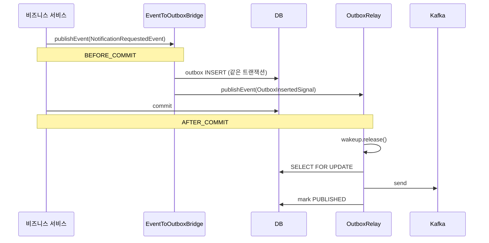

메시지 기반으로 잔고 변경을 알리고 있었는데, 잔고는 잘 바뀌었지만 그 사실을 알리는 이벤트가 사라지는 상황이 발생했다. <br>
프로세스가 죽는 시점이 *DB 커밋 직후, 메시지 발행 직전*이라는 좁은 구간이긴 하지만, 한 번 발생하면 정합성이 영구적으로 깨진다. <br>
이 문제를 해결하기 위해 **Transactional Outbox 패턴**을 직접 구현해보았다.

# 문제점
처음엔 흔히 쓰는 방식으로 구현했다. <br>
비즈니스 로직이 끝나고 트랜잭션이 커밋된 후에 메시지를 발행하는 흐름이다. <br>
```java
@Transactional
public void processBuyOrder(...) {
    wallet.decreaseBalance(...);
    walletRepository.save(wallet);
    eventPublisher.publishEvent(new BuyOrderReadyEvent(...));
}
// AFTER_COMMIT 핸들러가 위 이벤트를 받아서 RabbitMQ로 발행
```
DB 커밋 후에 메시지가 발행되는 순서이기에 정상으로 보였다. <br>
하지만, DB 커밋과 메시지 발행은 서로 다른 자원이라는 게 핵심이다. <br>
DB 커밋이 끝났는데 메시지 발행 직전에 프로세스가 죽으면, 비즈니스 상태는 영구적으로 변했는데 그 사실을 알리는 이벤트는 영원히 사라진다. <br>
"잔고는 차감됐는데 매칭엔진은 그 주문을 못 받았다" 같은 깨짐이 생기는 것이다. <br>
이걸 보통 **dual-write 문제**라고 한다. <br>

거래소처럼 정합성이 돈과 직결되는 도메인에서는, 빈도가 낮더라도 한 번 발생하면 수동 보정이 필요하고, 사용자 신뢰가 깨진다. <br>

# 해결 방향
핵심 아이디어는 단순하다. <br>
**발행하려는 의도를 같은 DB 트랜잭션에 박아두는 것**이다. <br>
```java
@Transactional
public void processBuyOrder(...) {
    wallet.decreaseBalance(...);
    walletRepository.save(wallet);
    outboxRepository.save(new OutboxMessage(...));   // ← 같은 트랜잭션
}
// 별도 relay가 outbox 읽어 broker 발행 → 마킹
```
비즈니스 변경(잔고 차감)과 발행 의도(outbox row INSERT)가 한 DB 트랜잭션 안에서 같이 커밋된다. <br>
broker로 가는 실제 발행은 언젠가 일어나면 된다. <br>
별도 relay가 outbox 테이블에서 PENDING 상태인 row를 찾아 broker로 발행하고 PUBLISHED로 마킹하는 구조다. <br>
중간에 relay가 죽어도 다음 라운드에서 같은 row를 찾아 다시 발행한다. <br>

두 자원(DB + broker) 사이에 있던 atomicity 문제를 DB 한 곳으로 좁힌 셈이다. <br>
DB 한 곳의 atomicity는 트랜잭션이 보장해주고, broker로 가는 발행은 *최소 한 번*은 보장된다. <br>

# 라이브러리 검토
이 패턴을 명시적으로 구현하는 라이브러리가 이미 여러 개 있다.
- **Namastack Outbox**: Spring Boot용 outbox 라이브러리. 컬리가 도입 사례를 공유했다 ([컬리 기술블로그](https://helloworld.kurly.com/blog/2026-outbox-pattern-and-retry-topic/))
- **Eventuate Tram**: SAGA 책 저자인 Chris Richardson이 만든 라이브러리. 명시적으로 *Transactional Outbox*로 명명되어 있다.
- **Gruelbox transaction-outbox**: 라이브러리 이름 자체가 패턴명. 가벼운 Java 라이브러리고 Spring 의존이 없다.

그런데도 직접 구현했다. <br>
이유는 외부 의존의 결정적 면적을 좁히고 싶었기 때문이다. <br>
라이브러리 스펙이 변경되면 우리 시스템 동작에 직접 영향을 미치는데 이 자체가 설게에선 치명적이라고 생각했다. <br>

다만, 외부 의존 자체를 피하는 게 목표는 아니다. <br>
Spring, Hibernate, Kafka client도 외부 의존이고 이걸 다 피할 수는 없다. <br>
이번 outbox는 코드 100줄 정도 수준이라, 작은 코드를 위해 큰 의존을 추가하는 trade-off가 안 맞다고 봤다. <br>
또 직접 부딪혀 보지 않으면 안 보이는 설계 결정 지점들이 있는데, 라이브러리만 썼으면 그 지점들 자체가 안 보였을 것이다. <br>

# 구현
코드는 세 부분으로 나눴다.
1. **Bridge**: 비즈니스 트랜잭션에 outbox INSERT를 끼워 넣는다.
2. **Signal**: outbox에 row가 들어갔다는 단순한 내부 시그널 이벤트.
3. **Relay**: outbox를 읽어 broker로 발행하고, 시그널을 받아 즉시 깨어난다.

전체 흐름을 그리면 다음과 같다.


## Bridge
```java
@Component
@RequiredArgsConstructor
public class EventToOutboxBridge {
    private final OutboxRepository outboxRepository;
    private final ObjectMapper objectMapper;
    private final ApplicationEventPublisher publisher;

    @TransactionalEventListener(phase = TransactionPhase.BEFORE_COMMIT)
    public void onNotificationRequested(NotificationRequestedEvent event) {
        save("notification.requested", String.valueOf(event.userId()), event);
    }

    private void save(String topic, String partitionKey, Object payload) {
        String json = objectMapper.writeValueAsString(payload);
        outboxRepository.save(OutboxMessage.builder()
                .topic(topic).partitionKey(partitionKey).payload(json).build());
        publisher.publishEvent(new OutboxInsertedSignal());
    }
}
```
핵심은 `@TransactionalEventListener(BEFORE_COMMIT)`다. <br>
이 리스너는 비즈니스 트랜잭션이 아직 살아 있는 동안 실행되기 때문에, 안에서 한 INSERT가 비즈니스 변경과 같은 트랜잭션에 묶인다. <br>
리스너에서 예외를 던지면 비즈니스 변경까지 같이 롤백된다. <br>
만약 AFTER_COMMIT으로 두면 별개 트랜잭션이 되어 dual-write 문제가 그대로 남는다. <br>
이 둘의 차이가 outbox 도입의 가장 본질적인 출발점이라고 생각한다. <br>

INSERT 직후엔 `OutboxInsertedSignal`을 발행하는데, 이건 outbox에 뭐가 들어갔다는 단순한 알림이다. <br>
어떤 비즈니스 이벤트인지는 신경 쓰지 않고, outbox row가 추가됐는지만 본다. <br>
이렇게 하면 wake 코드는 Relay 한 군데에만 존재하고, Bridge는 outbox INSERT 책임만 진다. <br>

## Relay
```java
@Component
@Slf4j
public class OutboxRelay {

    private final OutboxRepository outboxRepository;
    private final KafkaTemplate<String, String> kafkaTemplate;
    private final TransactionTemplate txTemplate;
    private final Semaphore wakeup = new Semaphore(0);
    private volatile boolean running = true;
    private Thread relayThread;

    @PostConstruct
    public void start() {
        relayThread = new Thread(this::loop, "outbox-relay");
        relayThread.setDaemon(true);
        relayThread.start();
    }

    @TransactionalEventListener(phase = TransactionPhase.AFTER_COMMIT)
    public void onOutboxInserted(OutboxInsertedSignal signal) {
        wakeup.release();
    }

    private void loop() {
        while (running) {
            if (wakeup.tryAcquire(1, TimeUnit.SECONDS)) {
                wakeup.drainPermits();
            }
            drainBatch();
        }
    }

    private void drainBatch() {
        txTemplate.executeWithoutResult(status -> {
            List<OutboxMessage> pending = outboxRepository.findPendingForUpdate(PageRequest.of(0, 200));
            for (OutboxMessage msg : pending) {
                kafkaTemplate.send(msg.getTopic(), msg.getPartitionKey(), msg.getPayload()).get();
                msg.markPublished();
            }
        });
    }
}
```
Relay는 백그라운드 스레드 하나를 띄워 돌린다. <br>
`Semaphore(0)`은 permit이 0개로 시작하므로, 스레드는 신호가 올 때까지 잠든다. <br>
신호가 오면 즉시 깨어나서 drainBatch를 호출하고, 안 오면 1초 타임아웃으로 깨어나서 폴링을 한 번 한다. <br>
타임아웃을 둔 이유는 신호가 유실되는 경우(프로세스 재시작 직후 등)에도 발행이 멈추지 않도록 하기 위한 안전망이다. <br>

# 설계 결정들

## 1. 왜 릴레이 스레드를 하나만 두는가
처음엔 latency를 줄이기 위해 50ms 스케줄러와 1초 스케줄러를 동시에 돌리는 형태로 시도했었다. <br>
50ms는 push trigger를 받자마자 깨우고, 1초는 안전망이라고 생각했다. <br>
하지만 부하 테스트에서 lock 충돌이 폭증했다. <br>
> 50ms 스케줄러가 SELECT FOR UPDATE로 row를 잡고 있는 동안 <br>
> 1초 스케줄러가 같은 row에 락을 시도 <br>
> NOWAIT라 즉시 실패 → 트랜잭션 롤백 → 발행 지연

같은 일을 하는 두 워커가 같은 자원을 두고 자기 자신과 경쟁하는 구조였다. <br>

해결은 단순했다. **워커를 하나로 줄이는 것**. <br>
워커가 하나면 자기 자신과 경쟁할 일이 없고, 신호를 받든 타임아웃이든 같은 한 스레드가 처리하기 때문에 락 자체가 의미를 잃는다. <br>

다만 "단일 릴레이가 옳은 design이라 골랐다"가 아니라 "자기 충돌을 가장 단순하게 회피한 형태다"가 정확하다. <br>
처리량을 더 짜내야 하면 send 호출을 async batch로 바꾸거나 릴레이를 다중으로 가는 옵션이 있고, 이건 측정 후 결정할 자리다. <br>

## 2. NOWAIT는 왜 분산 환경 도구인가
위에서 NOWAIT가 자기 충돌을 만들었다고 했다. <br>
NOWAIT 자체가 나쁜 게 아니라, **맥락이 안 맞았다**는 게 정확한 진단이다. <br>

`SELECT ... FOR UPDATE NOWAIT`의 시맨틱은 다음과 같다. <br>
> 락을 잡으려고 시도하되, 다른 누군가 이미 잡고 있으면 기다리지 말고 즉시 실패하라.

이게 의미를 갖는 건 분산 환경이다. <br>
인스턴스 A, B, C가 모두 같은 outbox 테이블을 보고 발행을 한다고 해보자.
1. A가 SELECT FOR UPDATE로 row 1~200을 잡는다.
2. B가 같은 SELECT FOR UPDATE NOWAIT를 시도. 락 충돌 → 즉시 실패 → "A가 잡고 있네, 다음 라운드에서 다른 row 잡으면 됨"으로 넘어간다.
3. C도 마찬가지.

NOWAIT 덕분에 인스턴스끼리 기다리지 않고 일을 분배할 수 있다. <br>
이게 NOWAIT의 본 목적이다. <br>

그런데 우리는 단일 인스턴스 안에서 NOWAIT를 썼다. <br>
양보할 다른 인스턴스가 없는 환경에서, 형제 스케줄러가 같은 row를 잡으려 하니 NOWAIT가 즉시 실패로 응답해버린 것이다. <br>
"양보 시맨틱"인데 양보할 대상이 자기 자신이라 모순이 됐다. <br>

현재 구조에선 NOWAIT를 뺐다. <br>
릴레이가 한 명이라 락 충돌 자체가 안 나기 때문에, NOWAIT든 일반 락 대기든 무관하다. <br>
미래에 인스턴스 N개로 수평 확장하면 다시 NOWAIT 또는 SKIP LOCKED 같은 분산 환경 락 전략이 의미를 갖는데, 어떤 게 적합한지는 측정 후 결정한다. <br>

## 3. cross-store에서의 read uncommitted
매수 흐름에서 outbox와는 무관해 보이지만, 같이 풀어야 했던 이슈가 있었다. <br>
처음엔 매수 흐름 전체가 외곽에 큰 `@Transactional` 하나로 묶여 있었다. <br>
```java
@Transactional
public void placeBuyOrder(...) {
    fundsClient.debitKrw(...);                    // sync RPC
    Order order = orderService.createBuyOrder(...);   // DB INSERT (uncommitted)
    orderBookService.placeOrder(order);              // ← Redis 즉시 등록
    matchingEngine.match()...
}
```
문제는 `orderBookService.placeOrder(order)`가 Redis에 즉시 등록을 한다는 점이다. <br>
Order는 외곽 트랜잭션이 끝날 때 비로소 DB에 commit되는데, Redis에는 commit 전에 이미 보이는 상태가 된다. <br>

다른 스레드의 매칭이 이 시점에 OrderBook(Redis)에서 그 Order를 발견하면, DB findById는 아직 commit 안 된 row를 찾으려 한다. <br>
DB의 read committed 격리수준에 따라 못 찾고 `ORDER_NOT_FOUND`를 던진다. <br>
부하 테스트에서 산발적으로 `주문 정보를 찾을 수 없습니다`가 떴고, 추적해보니 위와 같은 race였다. <br>

이건 DB read committed의 cross-store 버전이라고 볼 수 있다. <br>
DB의 read committed는 "같은 DB 안에서, 다른 트랜잭션의 uncommitted 데이터는 안 보인다"는 보증이다. <br>
하지만 Redis는 그 isolation을 모른다. <br>
DB가 read committed로 막아줄 일을 Redis는 그냥 다 보여주는 셈이다. <br>

해결은 단순했다. **Redis 등록을 DB commit 후에 한다**. <br>
```java
public void placeBuyOrder(...) {
    fundsClient.debitKrw(...);
    Order order = orderService.createBuyOrder(...);   // 자체 @Transactional, 여기서 commit
    orderBookService.placeOrder(order);              // commit 후 Redis 등록
    for (match : matchingEngine.match()) {
        matchProcessor.processMatch(match);          // 각 match는 자체 @Transactional
    }
}
```
외곽 `@Transactional`을 제거하고, `createBuyOrder`가 자체 `@Transactional`로 commit하도록 했다. <br>
그 후에 OrderBook에 등록하면, 다른 스레드가 보더라도 DB에 commit된 row가 있다. <br>
매칭별 처리는 별도 빈(`MatchProcessor`)으로 추출해 매칭 한 건당 자체 트랜잭션을 갖게 했다. <br>

이건 outbox 자체와는 무관해 보이지만, outbox 도입으로 트랜잭션 path가 길어지면서 잠재해 있던 결함이 드러난 사례라 같이 적어둔다. <br>

# 컨슈머 멱등성
outbox는 발행 보장까지만 책임진다. <br>
정확히 한 번 처리되도록 만들려면 컨슈머 측에서 별도 작업이 필요한데, 이게 컨슈머 멱등성이다. <br>

왜 필요한지 시나리오로 보자. <br>
릴레이가 Kafka에 메시지를 보내고, `markPublished` 를 commit 하기 직전에 프로세스가 죽으면 어떻게 될까. <br>
- Kafka에는 메시지가 이미 들어가 있음
- DB outbox row는 여전히 PENDING (commit 전이라 영속화 안 됨)
- 재시작 → 같은 row 또 SELECT → 같은 메시지 또 발행 → 컨슈머가 두 번 받음

비슷한 윈도우가 컨슈머 측에도 있다. <br>
컨슈머가 비즈니스 변경을 commit 한 후 Kafka offset commit 직전에 죽으면 같은 메시지를 다시 받는다. <br>
즉 단일 인스턴스든 다중 인스턴스든, **프로세스 크래시 타이밍만으로도 중복 처리는 발생한다**. <br>

해결은 컨슈머 측 dedup 패턴이다. <br>
1. 모든 이벤트에 `eventId`(UUID) 필드 추가
2. 컨슈머별 `processed_event` 테이블 (PK = eventId)
3. 컨슈머는 비즈니스 변경 + `processed_event` INSERT를 같은 트랜잭션에 묶음

```java
@KafkaListener(topics = "notification.requested", groupId = "notification")
@Transactional
public void handle(String json) {
    NotificationRequestedEvent event = objectMapper.readValue(json, ...);

    if (processedEventRepository.existsById(event.eventId())) {
        log.info("이미 처리된 이벤트, skip: eventId={}", event.eventId());
        return;
    }

    notificationSender.send(event.userId(), event.message());
    processedEventRepository.save(new ProcessedEvent(event.eventId()));
}
```

같은 트랜잭션에 묶이는 게 핵심이다. <br>
중복 메시지가 들어오면 `existsById` 가 true 를 반환하거나, race 가 나더라도 PK unique 제약으로 INSERT 가 실패하면서 트랜잭션 전체가 롤백된다. <br>
*비즈니스만 됐는데 dedup 마커 없음* 같은 상황이 구조적으로 불가능해진다. <br>

다만 한 가지 한계가 있다. <br>
`notificationSender.send()` 같은 **외부 시스템 호출**은 여전히 트랜잭션 밖이다. <br>
send → DB commit 사이에 크래시하면 외부 시스템은 이미 호출된 상태로 남는다. <br>
즉 dedup 으로 *DB 변경은 exactly-once* 가 되지만, *외부 호출은 여전히 at-least-once*. <br>
완전한 exactly-once 는 외부 시스템 측에서도 idempotency 를 보장해줘야 가능한데, 그건 분산 시스템의 본질적 한계라 *발행 + 컨슈머 측 dedup* 까지가 우리가 보장할 수 있는 한계다. <br>

현재 Kafka 컨슈머는 `infra-notification` 한 서비스에 3개 (`notification.requested`, `deposit.rejected`, `withdraw.rejected`) 뿐이라, dedup 테이블도 그쪽 한 군데에만 두면 된다. <br>
7단계에서 새 컨슈머(예: retry topic) 가 생기면 같은 패턴을 그쪽에도 적용한다. <br>

# 정량 비용
K6 부하 측정을 두 단계로 나눠서 했다. <br>
sync RPC + Outbox + Kafka 까지만 적용한 *중간 시점* 과, 컨슈머 멱등성까지 도입한 *최종 시점* 의 비용을 분리해서 보기 위해서다.

| 단계 | throughput | p95 | 에러율 |
|---|---|---|---|
| 도입 전 (gateway 직후) | 449/s | 494ms | 0% |
| sync RPC + Outbox + Kafka | 100/s | 2.5s | 0% |
| + 컨슈머 멱등성 | 62/s | 4.8s | 0% |

처음 측정 대비 응답 시간 약 10배, throughput 약 7배 떨어졌다. <br>
outbox 만의 비용을 분리하기는 어려운데, 추가된 구성 요소를 정리하면 다음과 같다.
- 비즈니스 트랜잭션에 outbox INSERT 1회 추가
- 릴레이의 SELECT FOR UPDATE 락 경합 (인스턴스 1개라 미미함)
- `KafkaTemplate.send().get()` 동기 발행
- 컨슈머마다 dedup 체크 (SELECT + INSERT) + 신규 notification-db 인스턴스

중간 → 최종 사이의 추가 손실(100 → 62/s) 은 거의 전부 *컨슈머 멱등성* 에서 왔다. <br>
이 비용은 정합성과 발행 보장, 처리 보장을 사기 위한 가격이라고 봐야 한다. <br>
원래 빠르던 게 느려진 게 아니라, 원래는 일을 다 하지 않고 응답을 돌려주던 시스템이 일을 다 하고 응답을 돌려주게 된 것이다. <br>

# 남은 부분
발행 보장과 컨슈머 멱등성까지가 본문에서 다룬 영역이고, 그 이상은 측정 후 결정할 항목들이라 의도적으로 비워뒀다.
- 다중 인스턴스 락 전략 (NOWAIT vs SKIP LOCKED)
- async Kafka publish (`send().get()` 제거)
- 다중 릴레이로의 확장
- retry topic / DLQ / 회로차단기

각 항목의 측정 계획과 트레이드오프는 [발행 보장 — 미뤄둔 결정들](발행%20보장%20—%20미뤄둔%20결정들.md) 문서에 정리해두었다. <br>
6/7단계에서 측정한 후 본문에 통합할 예정이다. <br>

# 결론
> Transactional Outbox는 DB와 broker 사이의 atomicity 문제를 DB 한 곳으로 좁히는 패턴이다. <br>
> 라이브러리도 좋은 옵션이지만, 100줄 정도의 작은 코드라 직접 부딪혀 보는 학습 가치가 의존 추가 비용보다 컸다. <br>
> 발행 보장은 outbox 가, 처리 보장은 컨슈머 측 dedup 이 맡는 역할 분담이고, 두 가지가 짝이 되어야 효과적으로 exactly-once 에 가까워진다. <br>
> 단일 릴레이 + push 신호는 현재 단계에서 가장 단순한 형태일 뿐, 최적이나 최종은 아니다. <br>
> 분산 환경 락 전략과 처리량 튜닝은 측정 후 결정한다는 원칙으로 미뤄두었다. <br>
> 측정 없이 단정하지 않는다 — 이게 미뤄둔 결정 doc과 함께 가는 원칙이다.
