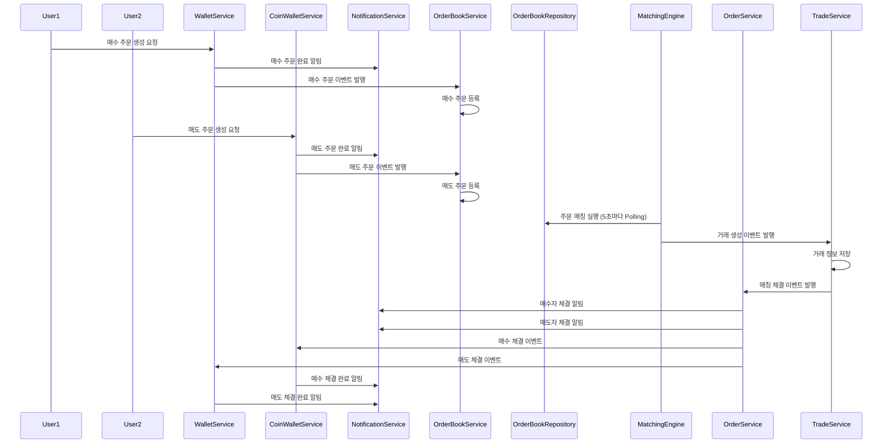
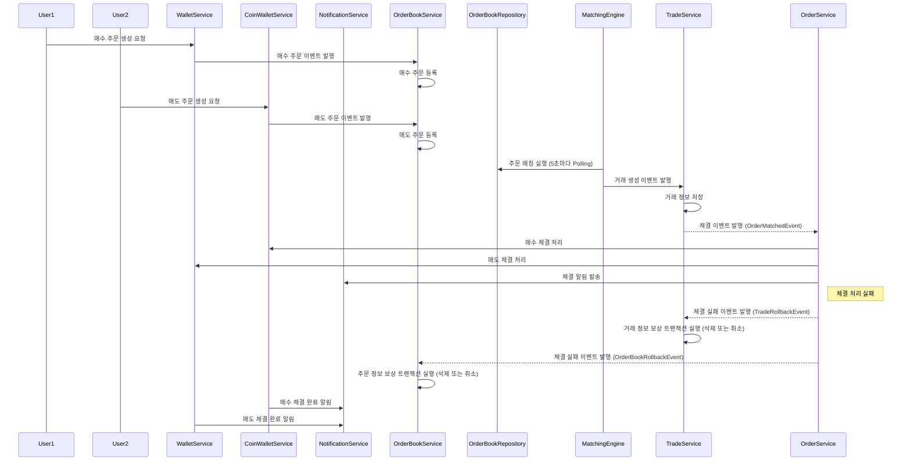

# 개요

현재 매수/매도 주문을 처리하는 시퀀스 다이어그램이다.  
매수/매도 처리 시 정합성을 보장할 필요성을 느꼈는데,  
예를 들어, 매수/매도 주문이 서로 체결되었을 경우 Trade테이블에 거래 정보가 저장되어야 한다.  
정보 저장 후 매수/매도 체결 처리를 진행하는데, 이때 매수/매도 체결 처리가 실패할 경우 Trade테이블에 저장된 거래 정보는 남아있게 된다.  
이런 상황을 방지하기 위해, 매수/매도 체결 처리가 실패할 경우 Trade테이블에 저장된 거래 정보를 삭제하는 **보상 트랜잭션**을 만들어야 한다.  

# SAGA 패턴
SAGA 패턴을 사용하면 여러 서비스들을 하나의 트랜잭션인 것처럼 묶어서 처리할 수 있다.  
SAGA 패턴은 두 가지 방식으로 구현할 수 있다.  
1. choreography: 이벤트 기반으로 각 서비스가 서로의 이벤트를 구독하고 처리하는 방식
2. orchestration: 중앙 집중식으로 하나의 서비스가 모든 트랜잭션을 관리하는 방식

두 방식의 장단점은 다음과 같다.  

| 방식          | 장점                                         | 단점                                         |
|---------------|--------------------------------------------|--------------------------------------------|
| choreography  | 서비스 간의 결합도가 낮아 유연성이 높음          | 트랜잭션 흐름이 복잡해질 수 있음                |
| orchestration | 트랜잭션 흐름이 명확하고 관리하기 쉬움          | 중앙 집중식으로 인해 단일 실패 지점이 될 수 있음 |
나는 최대한 서비스 간의 결합도를 낮추고 유연성을 높이기 위해 choreography 방식을 선택했다.  

SAGA 패턴의 동작 방식은 다음과 같다.  
1. 사용자가 매수/매도 주문을 생성한다.
2. 매수/매도 주문 이벤트가 발생한다.
3. 이벤트를 구독하고 있는 서비스가 매수/매도 주문을 처리한다.
4. 매수/매도 주문 처리 후, Trade 테이블에 거래 정보를 저장한다.
5. 매수/매도 체결 처리를 진행한다.
6. 매수/매도 체결 처리가 실패할 경우, Trade과 OrderBook 테이블을 롤백하는 보상 트랜잭션을 실행한다.

단편적으로 매수/매도 주문을 처리하는 시퀀스 다이어그램을 SAGA 패턴으로 변경하면 다음과 같다.  

이전 출금 실패 처리를 했을 때와 동일하게 실패 이벤트를 통해 보상 트랜잭션을 실행할 수 있다.  

# 결론
만약 매수/매도 주문이 동기적으로 처리된다면, 이러한 보상 트랜잭션 없이 정합성을 보장할 수 있다.  
하지만, 서비스의 특성 상 매수/매도 주문이 동기적으로 처리되는 것은 적합하지 않다.  
따라서, SAGA 패턴을 사용하여 매수/매도 주문을 처리하는 것이 적합하다.  
동기적인 호출에 비해 서비스 간의 결합도가 낮아지고, 유연성을 높일 수 있지만, 그만큼 오류에 대한 처리가 복잡해진다.  
정합성을 지키기 위해선 실패 지점들을 정확히 파악하고, 보상 트랜잭션을 구현하는 것이 중요하다.  
