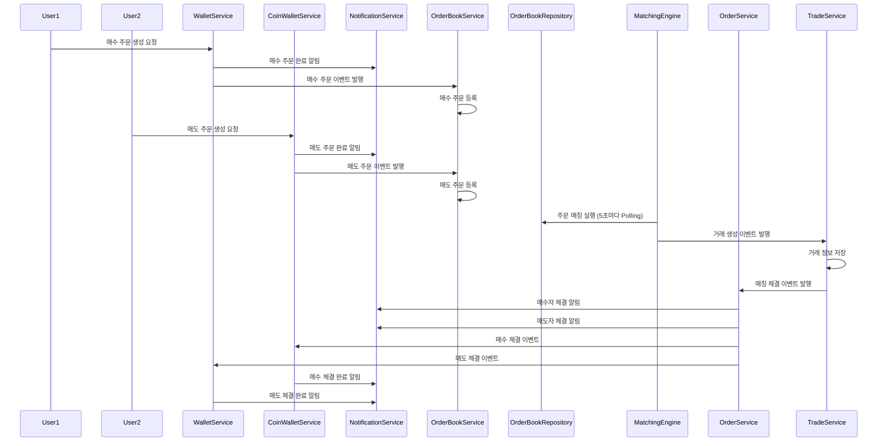

## 진행 플로우

### 입금
1. 사용자가 입금 요청을 한다.
2. 관리자는 입금 요청을 확인한다.

> case 1: 입금 요청이 승인된다.
3. 관리자가 입금을 승인한다.
4. 입금 승인 이벤트가 발생한다.
5. 이벤트를 구독하고 있는 서버가 입금 승인 이벤트를 수신한다.
6. 서버는 사용자의 잔고를 업데이트한다.

> case 2: 입금 요청이 거부된다.
3. 관리자가 입금 요청을 거부한다.
4. 거부 이벤트가 발생한다.
5. 이벤트를 구독하고 있는 서버가 거부 이벤트를 수신한다.
6. 서버는 사용자에게 거부 메시지를 전송한다.

### 매수/매도 주문

매수 주문과 매도 주문이 발생할 때마다 각각의 서비스가 이벤트를 발행하고, 이를 구독하는 서비스가 적절한 처리를 수행합니다.  
매칭 엔진은 5초마다 주문을 Polling하여 매칭을 수행하며, 체결 후에는 알림 서비스가 사용자에게 체결 결과를 전달합니다.
